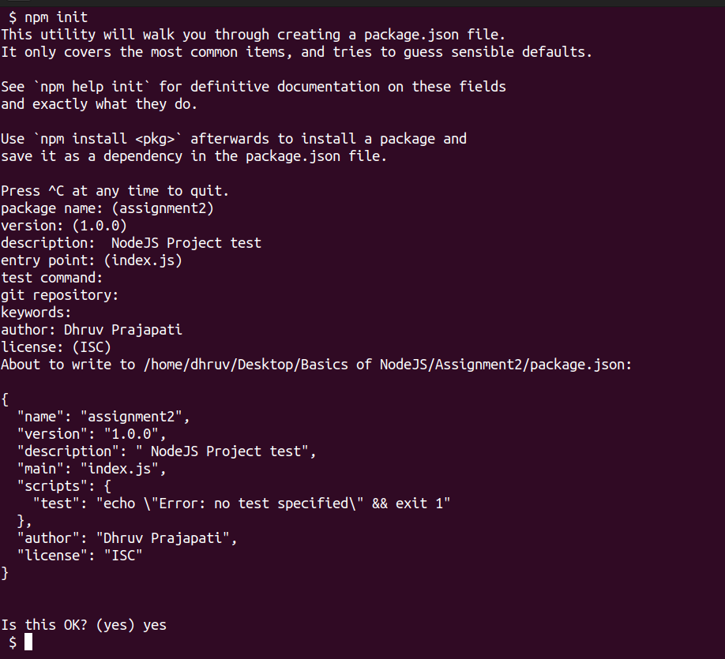

# NodeJS Basics Assignments

## Assignment2 - Initializing a Node Project

We use *Node Package Manager* (**npm**) utility to Initialize a NodeJS Project in an empty directory.

Using `npm init` command we can Initialize an Empty NodeJS Project. It prompts for following details...

- Package Name or Project Name

- Version of Project (Initially we start with 1.0.0 (default) and keep changing it as the Project grows)

- Description (Project Description - short)

- Entry point (Entry point for Node Scripts if the path is not provided)

- test command (Command for test script)

- Git repository (Git repository for Project)

- Keywords (Project keywords)

- Author (Author details)

- License (Project License)