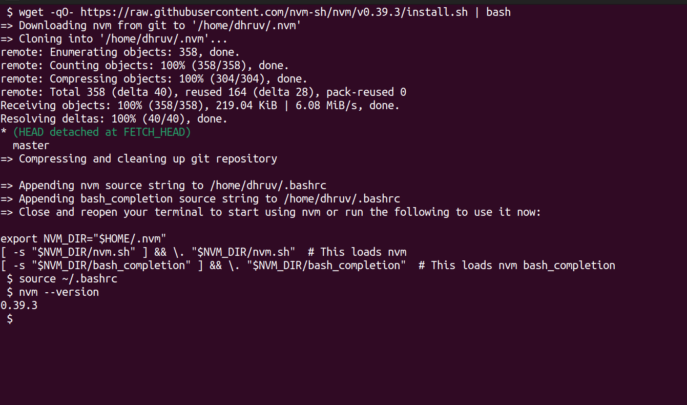
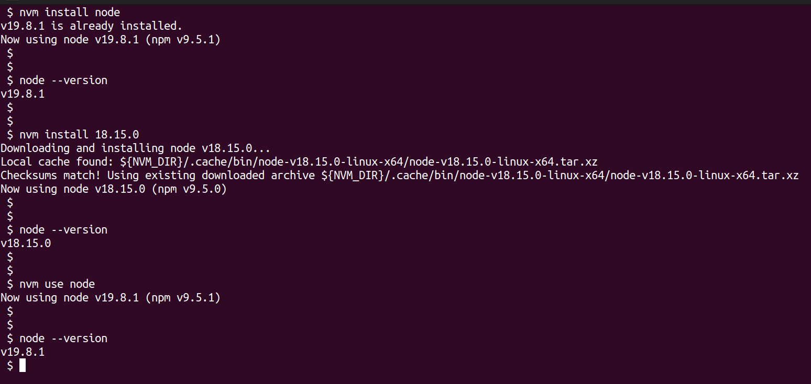
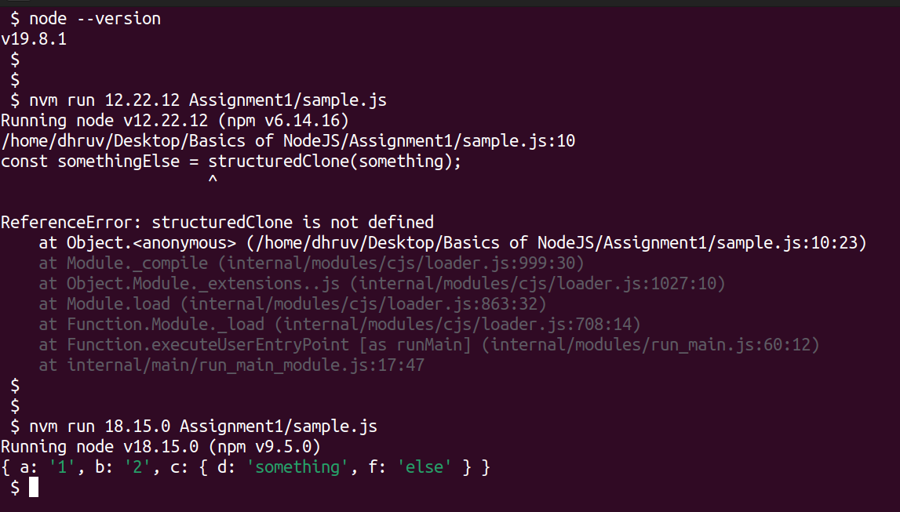

# NodeJS Basics Assignments

## Assignment1 - NodeJS installation using NVM

### What is NodeJS ?

Node.js is an open-source, cross-platform JavaScript runtime environment. It can be downloaded from [nodejs.org](https://nodejs.org), which is the official site for NodeJS. From this Official NodeJS site, we can download any version of NodeJS and install on our machine.

### What is NVM ?

NVM stands for **Node Version Manager**. NVM allows us to quickly install and use different versions of NodeJS via the command line.

### Why NVM ?

We could easily find any version of NodeJS we want on [nodejs.org](https://nodejs.org); but If we are working on multiple projects simultaneously and every one of them require different NodeJS versions then it will become a problem to install a new version of NodeJS on system everytime we want to work on another project. Also this way only one version of NodeJS will stay installed on our machine. 

But NVM let us switch between multiple versions of NodeJS with CLI tool and also provide facility so that we can install different versions of NodeJS.

### Installation Guide:

- The official Repository of [`nvm-sh`](https://github.com/nvm-sh/nvm) provides with latest release of NVM.

````bash
# Using wget utility to download and execute the Installation Script
wget -qO- https://raw.githubusercontent.com/nvm-sh/nvm/v0.39.3/install.sh | bash
````



- Once the NVM is installed, we can install any version of NodeJS; We can install any specific version of NodeJS and quickly switch to that version without any trouble.



- We can also run Javascript files with particular version of NodeJS without switching to that version entirely.

